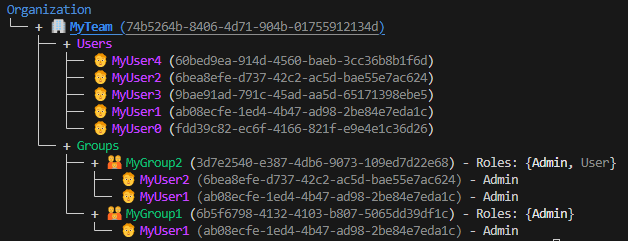

# Introduction

Project that allows you to manage Roles organized by teams, groups and users and generate access tokens with this information. It includes a command line tool. It is implemented using architecture patterns, Typer for command line and DynamoDB as database.

